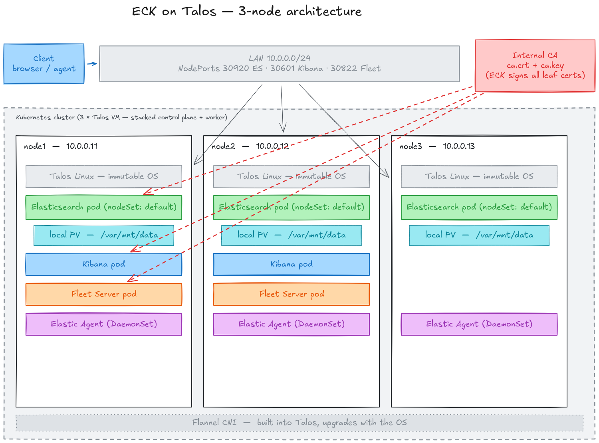

#  ECK on Talos

[](https://github.com/frederikb96/eck-on-talos/actions/workflows/ci.yaml)
[](https://opensource.org/licenses/MIT)

A hands-on guide to running a **production-ready, easy-to-maintain 3-node Elastic Stack** on **Talos Linux VMs** using **Elastic Cloud on Kubernetes (ECK)**. The result: Elasticsearch, Kibana, Fleet Server and Elastic Agent — all managed by the Kubernetes operator, running on an immutable OS with essentially zero maintenance burden.

> 🧪 **Tested end-to-end with 3 Azure VMs.** Every step in this guide was walked through by a fresh user on a new cluster before publishing, specifically to catch the "wait, what do I click here?" moments. A very similar setup has been running in production for multiple years, so the architecture is not experimental — just documented here in its most minimal, most teachable form.

> ☁️ **Want to try it out in the cloud in 30 minutes?** See [README-azure.md](README-azure.md) for a click-through guide that provisions 3 Talos VMs on Azure from the official Talos VHD image. Once your VMs report "maintenance mode", jump to [#set-your-cluster-variables](#set-your-cluster-variables) of this guide and keep going.

**Why Talos + ECK instead of installing Elasticsearch directly on a Linux VM?**

- **No OS maintenance.** Talos has no SSH, no package manager, no drift. You never patch kernels or run `apt upgrade`. Upgrades are a single declarative command.
- **No hand-tuning Elastic.** The ECK operator reconciles the cluster state from a single YAML file. Version upgrades, JVM settings, TLS, node roles — all declarative. Rolling restarts, certificate rotation and health checks happen automatically.
- **One Git repo is the entire system.** The Talos config, storage layout, CA, and Elastic Stack live in version-controlled files. Nothing lives only on a server.
- **Production patterns out of the box.** Self-monitoring (Stack Monitoring), Elastic Agent with the Kubernetes integration, and a proper internal CA are all wired in.

This guide is intentionally opinionated and keeps the moving parts to a minimum. No Terraform, no Flux, no cert-manager, no ingress controller — just `talosctl`, `kubectl` and `helm`.

---

## Table of Contents

- [ECK on Talos](#-eck-on-talos)
  - [Table of Contents](#table-of-contents)
  - [What you get](#what-you-get)
  - [Optional extensions (not part of this guide, but easy to add later)](#optional-extensions-not-part-of-this-guide-but-easy-to-add-later)
  - [Repository structure](#repository-structure)
  - [Architecture](#architecture)
  - [Prerequisites](#prerequisites)
    - [Infrastructure](#infrastructure)
    - [Sizing the VMs (RAM budget per node)](#sizing-the-vms-ram-budget-per-node)
    - [Client workstation tools](#client-workstation-tools)
    - [Clone this repository](#clone-this-repository)
    - [Set your cluster variables](#set-your-cluster-variables)
    - [Pick your Talos version](#pick-your-talos-version)
  - [Step 1 — Boot Talos on each VM](#step-1--boot-talos-on-each-vm)
    - [Option A — ISO boot (recommended, works on any hypervisor that mounts ISOs)](#option-a--iso-boot-recommended-works-on-any-hypervisor-that-mounts-isos)
    - [Option B — `dd` from a rescue system](#option-b--dd-from-a-rescue-system)
    - [What "maintenance mode" means](#what-maintenance-mode-means)
  - [Step 2 — Locate the nodes and verify disks](#step-2--locate-the-nodes-and-verify-disks)
    - [🚨 Mandatory — pin the OS disk by a stable identifier](#-mandatory--pin-the-os-disk-by-a-stable-identifier)
    - [Data disk and network interface](#data-disk-and-network-interface)
  - [Step 3 — Generate the Talos machine config](#step-3--generate-the-talos-machine-config)
  - [Step 4 — Apply the config to each node](#step-4--apply-the-config-to-each-node)
  - [Step 5 — Bootstrap the cluster](#step-5--bootstrap-the-cluster)
  - [Step 6 — Verify all three nodes are Ready](#step-6--verify-all-three-nodes-are-ready)
  - [Step 7 — Create the internal CA](#step-7--create-the-internal-ca)
  - [Step 8 — Create namespaces and the CA secret](#step-8--create-namespaces-and-the-ca-secret)
  - [Step 9 — Create the StorageClass and PVs](#step-9--create-the-storageclass-and-pvs)
  - [Step 10 — Install the ECK operator](#step-10--install-the-eck-operator)
  - [Step 11 — Install kube-state-metrics](#step-11--install-kube-state-metrics)
  - [Step 12 — Review values.yaml](#step-12--review-valuesyaml)
    - [What's pre-tuned (so you don't have to think about it)](#whats-pre-tuned-so-you-dont-have-to-think-about-it)
  - [Step 13 — Deploy the Elastic stack](#step-13--deploy-the-elastic-stack)
  - [Step 14 — Get the elastic user password](#step-14--get-the-elastic-user-password)
  - [Step 15 — Access Kibana](#step-15--access-kibana)
    - [Via NodePort (production access)](#via-nodeport-production-access)
    - [How NodePort routing actually works](#how-nodeport-routing-actually-works)
    - [Via kubectl port-forward (dev / testing)](#via-kubectl-port-forward-dev--testing)
    - [🚨 First thing to do in Kibana — set ILM policies for the observability data](#-first-thing-to-do-in-kibana--set-ilm-policies-for-the-observability-data)
    - [Next thing — check the Kubernetes overview dashboard](#next-thing--check-the-kubernetes-overview-dashboard)
  - [Step 16 — Trust the CA on clients](#step-16--trust-the-ca-on-clients)
  - [Step 17 — Enrolling external Elastic Agents](#step-17--enrolling-external-elastic-agents)
  - [Maintenance](#maintenance)
    - [Upgrading Talos](#upgrading-talos)
      - [What each `kubectl drain` flag does](#what-each-kubectl-drain-flag-does)
      - [`--reboot-mode powercycle`](#--reboot-mode-powercycle)
    - [Upgrading the ECK operator](#upgrading-the-eck-operator)
    - [Upgrading the Elastic Stack](#upgrading-the-elastic-stack)
    - [Changing a configuration value (Kibana / Elasticsearch)](#changing-a-configuration-value-kibana--elasticsearch)
    - [Adding secrets (the Elasticsearch keystore)](#adding-secrets-the-elasticsearch-keystore)
    - [Adding an S3 snapshot repository](#adding-an-s3-snapshot-repository)
    - [Clean reset (wipe all Elastic data and start over)](#clean-reset-wipe-all-elastic-data-and-start-over)
    - [Multiple Fleet outputs (Platinum)](#multiple-fleet-outputs-platinum)
    - [Activating the Enterprise Trial](#activating-the-enterprise-trial)
    - [Enabling audit logs](#enabling-audit-logs)
    - [Rotating the internal CA](#rotating-the-internal-ca)
  - [Troubleshooting](#troubleshooting)
  - [FAQ](#faq)
  - [License](#license)

---

## What you get

- **3 Elasticsearch nodes** with combined master + data + ingest + ml + transform roles
- **2 Kibana replicas** with anti-affinity across nodes
- **2 Fleet Server replicas** (for in-cluster agents and, optionally, external agents via NodePort)
- **Elastic Agent DaemonSet** (one per node) running the Elastic Agent integration plus the Kubernetes integration for full cluster observability
- **`kube-state-metrics`** deployed alongside the stack so the Kubernetes integration's `state_*` data streams (node/pod/deployment capacity and desired state) are populated out of the box — no empty dashboards
- **Self-monitoring** — Stack Monitoring writes its metrics and logs back into the same cluster, no separate monitoring cluster required
- **Internal CA** you fully control — ECK signs all HTTP certificates with it, so every client only has to trust one certificate
- **NodePort services** for Elasticsearch (30920), Kibana (30601) and Fleet Server (30822), reachable on any node IP → de-facto HA without a load balancer

## Optional extensions (not part of this guide, but easy to add later)

The philosophy of this guide is **start minimal, grow into complexity**. Everything below is something you _could_ add on top of the baseline setup. None of it is required to run a healthy Elastic Stack — and adding all of it upfront would bury the important ideas under tooling noise. Come back to this list once the basic stack is running and you know what you actually need.

- **Searchable snapshot / frozen tier.** This guide deploys a single hot tier (all 3 nodes hold the same kind of data). Adding a frozen tier later is mostly an Elasticsearch-level change: define a snapshot repository (see [Maintenance → Adding an S3 snapshot repository](#adding-an-s3-snapshot-repository) below for a worked example), and optionally define dedicated frozen nodes in a second `nodeSet`. The Talos + ECK foundation doesn't change.
- **External load balancer.** NodePort already gives you LAN-level HA because any client can hit any node IP and reach any replica (see [NodePort vs pod placement](#how-nodeport-routing-actually-works) below). If you want a single DNS name or you're serving traffic from outside the LAN, put HAProxy / your cloud LB in front of the three node IPs on ports 30920 / 30601 / 30822.
- **Ingress controller** (Traefik / NGINX / HAProxy-Ingress). Same logic — for a LAN deployment NodePort is enough. Add an ingress controller only if you're already running one cluster-wide, or you need path-based routing / host-based routing / advanced TLS termination.
- **cert-manager + Let's Encrypt.** Your internal CA is simpler and has no renewal cycle. Add cert-manager only if the cluster will serve publicly-routable DNS names and you actually want public CA-signed certs.
- **GitOps (Flux / Argo CD).** For a single cluster running a single workload, Flux is complete overkill. Its value comes from managing _many_ things across _many_ clusters. This repo stays intentionally Helm-CLI-driven — simple enough that a newcomer can follow it step by step, but still declarative enough that every change is a git commit.

Everything listed here has been deliberately left out to keep the moving parts minimal. The baseline setup is fully production-capable on its own.

---

## Repository structure

Everything the guide touches lives in one place:

```
eck-on-talos/
├── README.md                          ← THIS file
├── README-template.md                 ← Template for your own private ops repo
├── talos/
│   ├── patches/common.yaml            ← Cluster-wide Talos settings
│   └── nodes/node{1,2,3}.yaml         ← Per-node settings (hostname, IP, disk)
└── kubernetes/
    ├── namespaces.yaml                ← elastic-system + elastic-stack namespaces
    ├── storage/
    │   ├── storageclass.yaml          ← local-storage StorageClass
    │   └── pvs.yaml                   ← 3 local PVs pinned to node1/node2/node3
    ├── cleanup/
    │   └── wipe-data.yaml             ← 3 Jobs that wipe /var/mnt/data on each node
    │                                    (used only by the Clean reset procedure)
    ├── eck-operator/values.yaml       ← Helm values for the ECK operator
    └── eck-stack/values.yaml          ← Helm values for ES + Kibana + Fleet + Agent
```

Every one of these files is **small and heavily commented**. Open them as you go — the comments explain what each setting does, why it's set that way, and link to the upstream Elastic documentation. You'll learn more from reading `kubernetes/eck-stack/values.yaml` than from any README.

## Architecture



Three Talos VMs on the same LAN, each one a stacked Kubernetes control-plane + worker. Clients reach the services via NodePort (30920 Elasticsearch, 30601 Kibana, 30822 Fleet Server) — kube-proxy on any node load-balances to any available pod. Every node runs an Elastic Agent (DaemonSet) for cluster-wide observability; nodes 1 and 2 also run Kibana and Fleet Server (`count: 2` with anti-affinity), while node3 is ES + Agent only. Elasticsearch data lives on each node's second disk (`/var/mnt/data`) bound as a native Kubernetes local Persistent Volume. A single internal CA (stored in the `eck-ca` Secret) is used by ECK to sign the TLS leaf certificates for Elasticsearch, Kibana and Fleet Server — clients trust one `ca.crt` and get valid TLS on every component. Flannel CNI ships built into Talos, so there's no CNI to install or maintain.

---

## Prerequisites

### Infrastructure

- **3 virtual machines** on the same layer-2 / layer-3 segment. Any hypervisor (KVM / libvirt, Proxmox, VMware, Hyper-V, Nutanix, Azure, GCE, EC2, Hetzner Cloud…) works.
- **Per VM:**
  - ≥ 4 vCPU, **≥ 16 GiB RAM** (16 GiB is the recommended minimum — see sizing below)
  - **Disk 1 (system):** ≥ 32 GiB, Talos OS — you can use the hypervisor's default virtual disk
  - **Disk 2 (data):** ≥ 100 GiB, a second virtual disk dedicated to Elasticsearch data. Talos auto-mounts it at `/var/mnt/data` via `UserVolumeConfig`.
- **Static IPs** on the LAN. This guide assumes `10.0.0.11`, `10.0.0.12`, `10.0.0.13` as placeholders — you'll export your real values once in the [Set your cluster variables](#set-your-cluster-variables) block below, and every command and YAML file will follow along automatically.
- **DNS and default gateway** — Talos needs internet to pull its installer image and the container images the first time. An air-gapped setup is possible but out of scope here.

### Sizing the VMs (RAM budget per node)

**16 GiB per VM is the recommended minimum.** Here's the budget for the two busiest nodes (nodes 1 and 2 — they run Kibana and Fleet Server in addition to Elasticsearch):

| Component | Planned memory | Runs on |
|---|---|---|
| Elasticsearch | 8 GiB (locked, request == limit) | every node (1 ES pod per node) |
| Kibana | up to 2 GiB (request 1 GiB, no limit — bursts freely) | 2 of 3 nodes |
| Fleet Server | up to 2 GiB (request 1 GiB, no limit — bursts freely) | 2 of 3 nodes |
| Elastic Agent (DaemonSet) | up to 2 GiB (request 1 GiB, no limit — bursts freely) | every node |
| Talos OS + kubelet | ~2 GiB | every node |
| **Peak footprint on a busy node** | **≈ 16 GiB** | nodes 1 and 2 — node 3 has ~4 GiB headroom |

**Want more headroom?** Raise `resources.limits.memory` for Elasticsearch in `kubernetes/eck-stack/values.yaml`. ECK auto-sizes the JVM heap to ~50% of the container memory limit — no `ES_JAVA_OPTS` to touch.

- **Default: 8 GiB ES limit** → ~4 GiB heap. Fine for small/medium workloads.
- **Scale up to 64 GiB ES limit** → ~32 GiB heap. **This is the ceiling.** Above ~32 GiB heap the JVM loses compressed ordinary object pointers (compressed OOPs) and gets _less_ efficient, not more.
- Whatever ES limit you pick, the VM must fit it plus ~8 GiB of overhead (Kibana + Fleet + Agent + Talos). A 64 GiB ES limit therefore needs a ~72 GiB VM on nodes 1 and 2.

Need more capacity beyond a 64 GiB ES limit per node? **Add nodes, don't add RAM** — a single ES pod past that size is wasted money.

### Client workstation tools

```bash
talosctl version            # ≥ 1.12
kubectl version --client    # ≥ 1.28
helm version                # ≥ 3.14
openssl version             # 1.1 or 3.x
jq --version                # any recent version
```

Install commands that work on any Debian/Ubuntu box. All binaries come from their upstream release pages — no package manager gymnastics needed:

```bash
# talosctl — direct binary from the siderolabs/talos GitHub releases
curl -Lo talosctl https://github.com/siderolabs/talos/releases/latest/download/talosctl-linux-amd64
chmod +x talosctl && sudo install talosctl /usr/local/bin/ && rm talosctl

# kubectl — official upstream release
curl -LO "https://dl.k8s.io/release/$(curl -L -s https://dl.k8s.io/release/stable.txt)/bin/linux/amd64/kubectl"
sudo install kubectl /usr/local/bin/ && rm kubectl

# helm — official install script
curl -fsSL https://raw.githubusercontent.com/helm/helm/main/scripts/get-helm-3 | bash

# openssl + jq are almost certainly already installed — if not: sudo apt install openssl jq
```

> 🛈 **Homebrew alternative**: if you use Homebrew on Linux, `brew install siderolabs/tap/talosctl kubernetes-cli helm jq` covers everything in one command. See the [talosctl install docs](https://www.talos.dev/latest/talos-guides/install/talosctl/) for macOS / other platforms.

### Clone this repository

```bash
git clone https://github.com/frederikb96/eck-on-talos.git
cd eck-on-talos
```

All commands below assume you're in the repo root.

### Set your cluster variables

Every bash block in the rest of this guide reuses the same handful of shell variables — set them once here and you never have to paste an IP again. If you start a new shell later, re-paste this block before continuing.

The node gets **two IPs per machine** because on cloud VMs (Azure, EC2, Hetzner Cloud, …) the network the VM lives in is separate from the one your laptop lives in. On a flat bare-metal LAN they're identical — the second variable just defaults to the first and you don't have to think about it.

```bash
# LAN IP — what Talos binds eth0 to on each VM. This is the VM's OWN
# network: the bare-metal LAN, or the private VNet / VPC / subnet on
# cloud VMs. Inter-node traffic (etcd, kubelet, Flannel) uses these.
node1_lan_ip="10.0.0.11"
node2_lan_ip="10.0.0.12"
node3_lan_ip="10.0.0.13"

# Node IP — how CLIENTS reach the node from outside the cluster:
# kubectl, talosctl, curl, browser, ECK TLS SANs, Fleet NodePort URLs.
# Bare metal / flat LAN → defaults to the LAN IP, leave as-is.
# Cloud VMs → override with the PUBLIC IP of each node.
node1_ip="$node1_lan_ip"
node2_ip="$node2_lan_ip"
node3_ip="$node3_lan_ip"

# Cluster identity: used by 'talosctl gen config' and the internal CA subject.
cluster_name="eck-cluster"
ca_org="My Company"

# Optional TLS SubjectAltName DNS entries (appear on every leaf cert).
# Keep the placeholders, replace with real DNS you control, or delete the
# matching 'dns:' blocks in values.yaml if you don't use DNS at all.
elastic_dns="elastic.lan"
kibana_dns="kibana.lan"
fleet_dns="fleet.lan"
```

Now paint those values into every YAML file in the repo. The repo ships with clean `__NODE<N>_LAN_IP__` / `__NODE<N>_IP__` placeholders, one sed fills them all in:

```bash
sed -i \
  -e "s|__NODE1_LAN_IP__|$node1_lan_ip|g" \
  -e "s|__NODE2_LAN_IP__|$node2_lan_ip|g" \
  -e "s|__NODE3_LAN_IP__|$node3_lan_ip|g" \
  -e "s|__NODE1_IP__|$node1_ip|g" \
  -e "s|__NODE2_IP__|$node2_ip|g" \
  -e "s|__NODE3_IP__|$node3_ip|g" \
  -e "s|elastic\.lan|$elastic_dns|g" \
  -e "s|kibana\.lan|$kibana_dns|g" \
  -e "s|fleet\.lan|$fleet_dns|g" \
  talos/nodes/node*.yaml kubernetes/eck-stack/values.yaml
```

After this, both file sets contain **your** IPs and DNS names. Each Talos node config has its LAN IP on `eth0` and both IPs in `machine.certSANs` (Talos dedupes them on bare metal, so the block is zero-cost there and unlocks mTLS on cloud where the two IPs differ). The only manual YAML edit remaining is the per-node disk `wwid` in Step 2.

> 🛈 **Do I really need both IPs in `certSANs`?** On bare metal they're the same address and Talos dedupes — it's a no-op. On cloud, yes: your laptop reaches the Talos API on the **public** IP, while any in-cluster process (or a debug shell) reaches it on the **private** IP. Both have to be in the cert for mTLS to succeed from both directions.

### Pick your Talos version

```bash
talos_version="v1.12.6"
```

> 🛈 **About Talos schematics** (advanced, optional): Talos lets you add kernel modules or system extensions (ZFS, tailscale, iscsi-tools, …) via a "schematic" ID from [factory.talos.dev](https://factory.talos.dev). **This guide does NOT need any extensions** — the stock Talos image has everything ECK requires. Only set a `schematic` variable if you know you need a specific extension, and then prepend `${schematic}/` to the image URLs below.

---

## Step 1 — Boot Talos on each VM

Talos runs directly from a factory-built image. You have two installation paths.

### Option A — ISO boot (recommended, works on any hypervisor that mounts ISOs)

1. Download the stock Talos ISO directly from the siderolabs GitHub releases:
   ```bash
   wget "https://github.com/siderolabs/talos/releases/download/${talos_version}/metal-amd64.iso"
   ```
   (Or, if you want a custom schematic with extensions: `wget "https://factory.talos.dev/image/<your-schematic-id>/${talos_version}/metal-amd64.iso"`.)
2. Upload the ISO to your hypervisor's image store (Proxmox: "ISO images", VMware: datastore, libvirt: `/var/lib/libvirt/images`, Hetzner Cloud: attach ISO via API/Console).
3. For each VM: set the ISO as the boot device, power on, watch it boot into Talos maintenance mode.
4. Once all three VMs show the Talos dashboard with an IP on their console, unmount the ISO so the next boot uses the installed system disk.

### Option B — `dd` from a rescue system

Use this when your hypervisor doesn't let you attach an ISO but does give you a Linux rescue shell (e.g. Hetzner dedicated, bare-metal boxes).

```bash
cd /tmp
wget "https://github.com/siderolabs/talos/releases/download/${talos_version}/metal-amd64.raw.xz"
# Identify the system disk — DOUBLE CHECK THIS, the dd is destructive.
lsblk
# Wipe and write
wipefs -a /dev/sda
xz -dc metal-amd64.raw.xz | dd of=/dev/sda bs=4M status=progress && sync
reboot
```

After reboot the VM comes up in Talos maintenance mode on its primary disk.

### What "maintenance mode" means

Until you apply a machine config, Talos has:

- A DHCP-assigned IP (check your DHCP leases or the hypervisor console)
- An unauthenticated Talos API on port 50000 (that's why every command below uses `--insecure`)
- No Kubernetes yet

---

## Step 2 — Locate the nodes and verify disks

Find the three IPs your VMs currently respond on (DHCP leases, hypervisor console, or cloud VM public IPs), then export them — every command in Step 2 and Step 4 reuses these three variables:

```bash
# IPs to reach each VM WHILE IT'S STILL IN MAINTENANCE MODE. Only used
# until Step 4 applies the config — after that the VMs switch to their
# static $node<N>_lan_ip and you never touch tmp_ip_N again.
#
#   Bare metal / DHCP       → the DHCP lease of each VM (different from final IP)
#   Cloud VMs (Azure/EC2…)  → same as the final $node<N>_ip, just do:
#                               tmp_ip_1="$node1_ip"
#                               tmp_ip_2="$node2_ip"
#                               tmp_ip_3="$node3_ip"
tmp_ip_1="192.168.1.50"
tmp_ip_2="192.168.1.51"
tmp_ip_3="192.168.1.52"
```

Confirm all three are reachable in maintenance mode:

```bash
for ip in "$tmp_ip_1" "$tmp_ip_2" "$tmp_ip_3"; do
  talosctl -n "$ip" version --insecure
done
# Expected: each prints "API is not implemented in maintenance mode" — that's the green signal
```

Sanity-check what each VM sees — exactly two real disks (ignore `loop0`/`loop1`) and one network interface:

```bash
for ip in "$tmp_ip_1" "$tmp_ip_2" "$tmp_ip_3"; do
  echo "=== $ip ==="
  talosctl -n "$ip" get disks --insecure
  talosctl -n "$ip" get links --insecure
done
```

### 🚨 Mandatory — pin the OS disk by a stable identifier

Short device names (`/dev/sda`, `/dev/vda`, `/dev/nvme0n1`) are **not stable** — the letter depends on platform, kernel, and can change between reboots. Even identical VMs in the same cloud cluster can enumerate differently. If `machine.install` points at the wrong letter, a future `talosctl upgrade` will reinstall Talos onto your **data disk** and wipe it.

**Prefer `serial` on bare metal?** `machine.install.diskSelector` also accepts `serial`, `uuid`, `model`, `busPath`. Physical NVMe/SATA drives usually have a shorter `serial:` — swap `wwid:` for `serial:` in the YAML. Cloud VMs often have empty `serial`, so `wwid` is the safe universal default. Run `talosctl get disks <id> --insecure -o yaml` on any node to see every field Talos surfaces.

Pin the install target by `wwid` (hardware ID that never changes). Run this to print the wwid of each node's current OS disk:

```bash
for ip in "$tmp_ip_1" "$tmp_ip_2" "$tmp_ip_3"; do
  sysdisk=$(talosctl -n "$ip" get systemdisk --insecure -o json | jq -r .spec.diskID)
  wwid=$(talosctl -n "$ip" get disks "$sysdisk" --insecure -o json | jq -r .spec.wwid)
  printf "%-16s  %-10s  %s\n" "$ip" "$sysdisk" "$wwid"
done
```

Example output (the first column is whatever your `tmp_ip_N` values are — here DHCP leases):

```text
192.168.1.50      sdb         naa.6002248059bddfe77ab4c2f59bca39e4
192.168.1.51      sda         naa.600224800526fac1cb6de3faaa4744bd
192.168.1.52      sda         naa.6002248071cc72055d2a33429c539d4f
```

Now **manually** paste each node's wwid into the matching `talos/nodes/node<N>.yaml`, replacing the placeholder:

```yaml
machine:
  install:
    diskSelector:
      wwid: "naa.6002248059bddfe77ab4c2f59bca39e4"
```

### Data disk and network interface

- **Data disk:** second disk, size ≥ 100 GiB. The `UserVolumeConfig` at the bottom of each node YAML uses `!system_disk` to pick whatever disk is NOT the OS one, so it needs no edit regardless of device name.
- **Network interface:** usually `eth0`. If your VM uses `ens18`, `ens192`, `enp1s0`, etc. (check `get links` output), update the `interface:` field in `talos/nodes/node*.yaml`.

---

## Step 3 — Generate the Talos machine config

From the repo root, run `talosctl gen config` pointing at node1's IP as the cluster endpoint. `--additional-sans` bakes all three node IPs into the kube-apiserver cert, so `kubectl` can fail over between them without a TLS error:

```bash
talosctl gen config "$cluster_name" "https://$node1_ip:6443" \
  --talos-version v1.11 \
  --kubernetes-version 1.34.1 \
  --additional-sans "$node1_ip,$node2_ip,$node3_ip" \
  --config-patch @talos/patches/common.yaml \
  --output-dir _out
```

> 🛈 **Why `--talos-version v1.11`?** Starting with Talos 1.12, `gen config` emits a separate `HostnameConfig` document for the node hostname — which conflicts with the per-node `machine.network.hostname` in `talos/nodes/node<N>.yaml` and causes `apply-config` to fail with `static hostname is already set in v1alpha1 config`. Pinning the generator to v1.11 keeps hostname in the main `v1alpha1` document where our patches already live. Talos 1.12+ nodes accept v1.11-style config fine — full backward compat.

> 🛈 **Why `--kubernetes-version 1.34.1`?** `gen config` bakes a Kubernetes version into the config, and it defaults to whatever version *your `talosctl` binary* shipped with. If your `talosctl` is newer than the Talos version you're deploying (very common — the install command grabs `latest`), that default can be a Kubernetes version too new for Talos to accept, and `apply-config` fails with `version of Kubernetes X is too new to be used with Talos 1.12.6`. Pinning it to `1.34.1` (in Talos 1.12's supported range) sidesteps the whole client-vs-node skew. When you bump the Talos version, check the [Talos support matrix](https://www.talos.dev/latest/introduction/support-matrix/) and bump this too.

This produces:

```
_out/controlplane.yaml    ← the machine config for every node
_out/worker.yaml          ← unused (we stack CP + worker, see common.yaml)
_out/talosconfig          ← client certificate bundle for talosctl
```

Load the talosconfig into your local talosctl client and point it at the three nodes:

```bash
talosctl config merge _out/talosconfig
talosctl config endpoint "$node1_ip" "$node2_ip" "$node3_ip"
talosctl config node "$node1_ip"
```

> **What these three commands do:**
>
> - `talosctl config merge _out/talosconfig` reads the cluster-specific talosconfig that `gen config` just wrote and merges it into your **global talosctl config** at `~/.talos/config` (the default — override with `$TALOSCONFIG`). The merge creates a new **context** named after the cluster (`eck-cluster` here). Every `talosctl` command from now on picks up these client certs automatically.
> - `talosctl config endpoint …` sets which IPs talosctl dials. With multiple endpoints listed, talosctl round-robins and fails over — handy when one node is down.
> - `talosctl config node …` sets the DEFAULT `-n` target so you can omit `-n "$node1_ip"` from most commands.
>
> **Managing more than one Talos cluster?** Every `talosctl config merge` adds another context — they don't overwrite each other. Switch between clusters any time:
>
> ```bash
> talosctl config contexts                     # list every cluster you've merged
> talosctl config context my-other-cluster     # switch the active context
> ```
>
> Each context keeps its own endpoints, node default, and client certificates. Same mental model as `kubectl config use-context`.

> The `_out/` directory is gitignored. Keep `_out/talosconfig` safe — if you ever lose your global `~/.talos/config` you can re-merge from this file. It's the root credential for the cluster.

---

## Step 4 — Apply the config to each node

Apply the shared `controlplane.yaml` **plus** the per-node patch to every node. The node's hostname, interface, static IP and data disk mount all come from the patch. Reuse the `tmp_ip_1/2/3` variables you set in Step 2:

```bash
talosctl apply-config --insecure \
  --nodes "$tmp_ip_1" \
  --file _out/controlplane.yaml \
  --config-patch @talos/nodes/node1.yaml
```

Talos writes the config to its `STATE` partition, restarts networking, and you'll see the VM's `eth0` IP switch from its DHCP lease to `$node1_lan_ip`. Repeat for node2 and node3:

```bash
talosctl apply-config --insecure \
  --nodes "$tmp_ip_2" \
  --file _out/controlplane.yaml \
  --config-patch @talos/nodes/node2.yaml

talosctl apply-config --insecure \
  --nodes "$tmp_ip_3" \
  --file _out/controlplane.yaml \
  --config-patch @talos/nodes/node3.yaml
```

Give each node about 60 seconds after apply, then verify it responds on its new static IP:

```bash
for ip in "$node1_ip" "$node2_ip" "$node3_ip"; do
  talosctl -n "$ip" version
done
```

You should get a normal (non-maintenance) Talos version response.

---

## Step 5 — Bootstrap the cluster

Bootstrap etcd on **node1 only** (running this on more than one node will corrupt etcd):

```bash
talosctl bootstrap --nodes "$node1_ip" --endpoints "$node1_ip"
```

Now wait (up to 5 min) for Talos to finish the bootstrap, generate the kubeconfig, start the API server, and register node1. This block polls from the **client** side — it fetches the kubeconfig as soon as Talos writes it, then `kubectl get nodes` until node1 shows `Ready`. On timeout it dumps the recent Talos dmesg so you can see what's going on:

```bash
echo "⏳ waiting for kubeconfig..."
until talosctl kubeconfig --nodes "$node1_ip" --endpoints "$node1_ip" ./kubeconfig 2>/dev/null; do
  sleep 5
done
echo "✅ kubeconfig is ready"
export KUBECONFIG="$PWD/kubeconfig"

echo "⏳ waiting for node1 Ready..."
for i in $(seq 1 60); do
  kubectl get nodes 2>/dev/null | grep -q "^node1 .*Ready" && break
  sleep 5
done

if kubectl get nodes 2>/dev/null | grep -q "^node1 .*Ready"; then
  echo "✅ bootstrap completed"
  kubectl get nodes
else
  echo "⏱️  node1 not Ready after 5 min — recent dmesg tail:"
  talosctl -n "$node1_ip" dmesg 2>/dev/null | tail -60
fi
```

**Expected timing:** ~60-90 s on bare metal, ~2-3 min on cloud VMs. Node 2 and node 3 join automatically once node 1's API server is reachable — you usually see all three `Ready` within a minute of node 1 going green.

> 🛈 **Want to watch the bootstrap unfold live?** Open a second terminal (or substitute `$node2_ip` / `$node3_ip` to watch the other nodes join):
>
> ```bash
> talosctl -n "$node1_ip" dmesg -f          # follow kernel + Talos controller logs in real time
> talosctl -n "$node1_ip" service           # list all Talos services with state + health
> talosctl -n "$node1_ip" service etcd      # zoom into a specific service (e.g. etcd)
> talosctl -n "$node1_ip" logs etcd         # raw etcd logs
> talosctl -n "$node1_ip" logs kubelet      # raw kubelet logs
> ```
>
> `dmesg -f` is what the wait loop falls back to when it times out — running it yourself gives the same view in real time. Ctrl-C to stop. Use the cheat sheet below to tell benign noise from actual problems.

**While it's waiting, these Talos log lines are normal and should be ignored:**

- `k8s.NodeApplyController: timeout` / `error getting node: nodes "node1" not found` — kube-apiserver still starting
- `apiserver-kubelet-client: Authorization error` — RBAC bindings not installed yet
- `KubePrism 127.0.0.1:7445: EOF` — local API proxy flapping during apiserver warm-up
- `network.LinkSpecController: error enslaving/unslaving link "eth1"` — Azure Accelerated Networking SR-IOV VF noise, cosmetic only

**These lines mean something is actually wrong:**

- `service[etcd](Failed)` after the initial "Bootstrap requested" — real etcd failure, check the message
- Static pods (`kube-apiserver`, `kube-controller-manager`, `kube-scheduler`) in a `CrashLoopBackOff` pattern — wrong installer image, PKI mismatch, or patch drift
- `permission denied` / `no such file or directory` on volume mounts — UserVolumeConfig or diskSelector pointed at the wrong disk
- Complete silence for 2+ min with no new log lines — node hung, check the hypervisor console

---

## Step 6 — Verify all three nodes are Ready

Step 5 already fetched `./kubeconfig` and exported `KUBECONFIG`. Just confirm all three nodes reached `Ready` (node 2 and node 3 join automatically once node 1's API server is up):

```bash
kubectl wait --for=condition=Ready nodes --all --timeout=5m
kubectl get nodes
# node1   Ready   control-plane   ...
# node2   Ready   control-plane   ...
# node3   Ready   control-plane   ...
```

If a node is stuck, see [Troubleshooting](#troubleshooting).

> Flannel CNI comes built-in with Talos — you don't install a CNI, don't run `kubectl apply -f cilium.yaml`, don't configure anything. It just works.

---

## Step 7 — Create the internal CA

> **What this step does:** Creates a single Certificate Authority that ECK will use to sign the TLS certificates for Elasticsearch, Kibana and Fleet Server. One CA → three certs → one thing for clients to trust.
>
> **Docs:** [ECK TLS certificates — custom CA](https://www.elastic.co/guide/en/cloud-on-k8s/current/k8s-tls-certificates.html)

This is the one step that's genuinely different from a vanilla Elastic-on-VMs install: by default ECK generates three separate self-signed CAs (one per component), and your customers would have to trust all three. Instead, we give ECK our own CA, it uses that CA to sign fresh leaf certs for every component, and clients only have to trust the **one** `ca.crt` we give them.

Create a 10-year CA:

```bash
mkdir -p ca && cd ca

openssl genrsa -out ca.key 4096

openssl req -x509 -new -nodes -key ca.key -sha256 -days 3650 \
  -subj "/CN=ECK Internal CA/O=${ca_org}" \
  -out ca.crt

cd ..
```

> `ca.key` and `ca.crt` are gitignored. Store them somewhere safe — if you lose `ca.key` you can only rotate by regenerating everything.

> Already have an internal company CA? Skip this step. Point `ca.key` / `ca.crt` at the real ones — ECK treats any CA + key pair identically.

---

## Step 8 — Create namespaces and the CA secret

> **What this step does:** Creates the two namespaces the stack lives in (`elastic-system` for the operator, `elastic-stack` for the data plane), then uploads your CA as a Kubernetes Secret so ECK can use it to sign TLS certificates.
>
> **Docs:** [ECK custom certificates (BYO CA)](https://www.elastic.co/guide/en/cloud-on-k8s/current/k8s-tls-certificates.html) · [Pod Security Standards](https://kubernetes.io/docs/concepts/security/pod-security-admission/)

```bash
kubectl apply -f kubernetes/namespaces.yaml

kubectl -n elastic-stack create secret generic eck-ca \
  --from-file=ca.crt=ca/ca.crt \
  --from-file=ca.key=ca/ca.key
```

**How the BYO CA magic works:** When ECK finds a Secret with BOTH `ca.crt` **and** `ca.key`, it treats it as a signing CA — meaning ECK uses YOUR key to sign fresh leaf certificates for every component (Elasticsearch, Kibana, Fleet Server). Each component gets its own leaf cert, but all three leaves chain back to your single CA. Clients only have to trust **one** `ca.crt` and everything works.

Both namespaces get the `pod-security.kubernetes.io/enforce: privileged` label. This is required because ECK uses a privileged init container to raise `vm.max_map_count`, and the Elastic Agent DaemonSet mounts host paths for container log collection. Without the privileged label, Kubernetes Pod Security Admission rejects those pods. This is a Kubernetes feature, not a Cilium/Talos quirk.

---

## Step 9 — Create the StorageClass and PVs

> **What this step does:** Tells Kubernetes that `/var/mnt/data` on each node (the mount point Talos created for the dedicated data disk) is a storage volume, so Elasticsearch pods can use it for their data.
>
> **Docs:** [Kubernetes Local Volumes](https://kubernetes.io/docs/concepts/storage/volumes/#local) · [ECK volumeClaimTemplates](https://www.elastic.co/guide/en/cloud-on-k8s/current/k8s-volume-claim-templates.html)

We use the Kubernetes native **local volumes** pattern:

| Object | What it does |
|---|---|
| `StorageClass: local-storage` | Says "no dynamic provisioner; volumes are pre-created by hand" and sets `volumeBindingMode: WaitForFirstConsumer` so a PVC only binds once a pod wants to use it. |
| `PersistentVolume: es-data-node1` | A 100 GiB volume pinned to node1 via `nodeAffinity`, pointing at `/var/mnt/data` on that node (the entire dedicated data disk — Elasticsearch creates its own `nodes/` subtree inside). |
| `PersistentVolume: es-data-node2` | Same, pinned to node2. |
| `PersistentVolume: es-data-node3` | Same, pinned to node3. |

```bash
kubectl apply -f kubernetes/storage/storageclass.yaml
kubectl apply -f kubernetes/storage/pvs.yaml

kubectl get storageclass
kubectl get pv
```

Each PV starts in the `Available` phase. When Elasticsearch is deployed (Step 13), the StatefulSet creates three PVCs. Because of `WaitForFirstConsumer`, the PVCs don't bind immediately — they wait until the scheduler picks a node for each pod. The scheduler sees the anti-affinity rules AND the PV nodeAffinities, picks one node per pod, and only then the PVC binds to the matching PV.

**The net effect:** Each Elasticsearch pod is locked to one node forever. Its data lives on that node's local disk. If the pod dies and gets recreated, Kubernetes puts it back on the same node because that's the only place its PVC is bound. Automatic data locality, zero CSI driver, zero Longhorn/Ceph/Mayastor.

> 🛈 **Need bigger disks?** Edit `kubernetes/storage/pvs.yaml` and bump `storage: 100Gi` to whatever your data disks allow. Do this **before** deploying the stack — you cannot grow a local PV after creation. You can always add a second PV per node and run a second ES nodeSet that binds to it.

---

## Step 10 — Install the ECK operator

> **What this step does:** Installs the ECK operator — a single Deployment that watches Elasticsearch/Kibana/Agent/Fleet Server custom resources and reconciles them into working StatefulSets and Services.
>
> **Docs:** [Install ECK using Helm](https://www.elastic.co/guide/en/cloud-on-k8s/current/k8s-install-helm.html) · [ECK overview](https://www.elastic.co/guide/en/cloud-on-k8s/current/index.html)

```bash
helm repo add elastic https://helm.elastic.co
helm repo update

helm upgrade --install eck-operator elastic/eck-operator \
  --version 3.5.0 \
  --namespace elastic-system \
  --values kubernetes/eck-operator/values.yaml

kubectl -n elastic-system rollout status statefulset/elastic-operator --timeout=2m
```

The operator pod should reach `1/1 Running` in under a minute. From this point on, everything you want in the cluster is declared as a YAML resource (`kind: Elasticsearch`, `kind: Kibana`, etc.) and the operator does the heavy lifting — no more `kubectl apply` of StatefulSets, no more manually-crafted ConfigMaps.

**What the operator does for you** (so you don't have to):
- Generates all TLS certificates for transport and HTTP layers
- Manages the Elasticsearch cluster state (rolling upgrades, shard rebalancing during node changes)
- Creates the `elastic`, `kibana_system`, and service-account users automatically
- Injects readiness and liveness probes that actually understand Elasticsearch
- Handles version upgrades (drain → restart → wait for green → next node)
- Rotates certificates before they expire (for ECK-generated ones — NOT your BYO CA)

---

## Step 11 — Install kube-state-metrics

> **What this step does:** Installs [`kube-state-metrics`](https://github.com/kubernetes/kube-state-metrics) — a small Deployment that scrapes the Kubernetes API and exposes cluster-wide state (node capacity, pod counts, deployment replicas, persistent volume status, …) as a Prometheus-format metrics endpoint. The Elastic Agent's Kubernetes integration then scrapes that endpoint to fill in the `metrics-kubernetes.state_*` data streams.
>
> **Docs:** [kube-state-metrics chart](https://github.com/prometheus-community/helm-charts/tree/main/charts/kube-state-metrics) · [Elastic Kubernetes integration overview](https://www.elastic.co/guide/en/integrations/current/kubernetes.html)

```bash
helm repo add prometheus-community https://prometheus-community.github.io/helm-charts
helm repo update

helm upgrade --install kube-state-metrics prometheus-community/kube-state-metrics \
  --version 7.2.2 \
  --namespace elastic-stack

kubectl -n elastic-stack rollout status deploy/kube-state-metrics --timeout=2m
```

> 🛈 **Why this is a dedicated step, and why it matters for the dashboards.** The Elastic Kubernetes integration has **two independent data sources**:
>
> - **kubelet** — scraped directly on every node, gives you live **usage**: "node2 is using 242 millicores right now, working set is 8.4 GiB". These populate `metrics-kubernetes.node / pod / container / volume / system`.
> - **kube-state-metrics** — scraped once per cluster, gives you **capacity and desired state**: "node2 has 8 CPU cores total, 62 GiB allocatable memory, room for 110 pods; deployment X wants 3 replicas and has 3 ready". These populate the `metrics-kubernetes.state_*` family (`state_node`, `state_pod`, `state_deployment`, `state_persistentvolume`, …).
>
> Kibana's built-in Kubernetes dashboards **join both sides** to draw their graphs. "CPU usage % by node" is `kubelet.cpu.usage.nanocores ÷ state_node.cpu.capacity.cores`. Without `kube-state-metrics`, the kubelet side still ships data but the capacity/state side is empty → every percentage panel renders blank and the overview dashboard looks broken. Installing it takes 30 seconds and fills in everything.

> 🛈 **Why install it in `elastic-stack` and not `kube-system`.** The default `hosts` value in the Elastic Kubernetes integration is the unqualified DNS name `kube-state-metrics:8080`. Kubernetes resolves unqualified names through the pod's namespace search path, so an agent pod running in `elastic-stack` will look up `kube-state-metrics.elastic-stack.svc` first — which is exactly the Service this Helm install creates. Zero integration config changes needed. As a bonus, everything this guide installs lives in a single namespace: `helm uninstall` in the Clean reset procedure sweeps both the stack *and* `kube-state-metrics` in one go.

---

## Step 12 — Review values.yaml

> **What this step does:** Takes a look at the Helm values file that defines your entire Elastic Stack, so you know what you're about to deploy.

The sed in [Set your cluster variables](#set-your-cluster-variables) already replaced the placeholder IPs and DNS names with your real ones. All that's left is to skim the file once — it's heavily commented, with inline explanations and links to the relevant Elastic docs for every non-trivial setting.

```bash
$EDITOR kubernetes/eck-stack/values.yaml   # or: less, cat, whatever you prefer
```

> 🛈 **Where the node IPs ended up:**
>
> 1. **TLS SubjectAltNames.** Each IP became a SAN entry on the leaf certificates ECK signs with your CA. When a client connects to `https://$node1_ip:30920`, TLS validation checks that the IP is in the cert's SAN list. If it's not, the handshake fails.
> 2. **Default Fleet outputs for newly enrolled agents.** The Kibana config declares a default Fleet output and a default Fleet Server host, both listing all three node IPs on the NodePort. Every newly enrolled agent receives all three and fails over between them if one is unreachable → de-facto HA across all three nodes without any external load balancer.
>
> 🛈 **Not using DNS?** If you left the placeholders `elastic.lan` / `kibana.lan` / `fleet.lan` in your variables block, they're still in `values.yaml`. Either leave them (no harm — just unused SAN entries on the cert) or open `values.yaml` and delete the three `dns:` lines. You can always add DNS names later without re-issuing the certs if you widen the SAN list.

### What's pre-tuned (so you don't have to think about it)

| Setting | Value | Why |
|---|---|---|
| ES memory request == limit | `8Gi` == `8Gi` | Elasticsearch is allergic to memory pressure. Request==limit gives it "Guaranteed" QoS and locks the allocation. ECK auto-sizes the JVM heap to ~50% of this — no `ES_JAVA_OPTS` to fiddle with. |
| Kibana / Fleet Server / Agent memory | request `1Gi`, no limit | Stateless services — they can burst freely under load without risk of OOM-kill. |
| Kibana self-monitoring | ON | Stack Monitoring data ships back into the same cluster — one UI to rule them all. |
| `server.publicBaseUrl` | `https://$node1_ip:30601` | The public URL Kibana uses in callbacks / links. Defaults to your node1 NodePort URL — replace with your LB / DNS name if you have one (edit `eck-kibana.config.server.publicBaseUrl` in `values.yaml`). |
| Fleet Server replicas | 2 | HA, spread across two nodes via anti-affinity. |
| Elastic Agent Kubernetes integration | ON | Cluster-wide observability on every node by default. |
| Pod anti-affinity | Enforced (required) | Kubernetes scheduler refuses to place two pods of the same type on the same node. |
| Fleet output | Single default (NodePort HA list) | Fleet Server and Elastic Agent inherit the default output. Splitting outputs per policy (e.g. in-cluster agents via `.svc`, external agents via a load balancer) is an opt-in for later — see [Multiple Fleet outputs](#multiple-fleet-outputs-platinum) in Maintenance. |
| Audit logging (ES + Kibana) | Off by default | Audit logging is a paid feature, so `xpack.security.audit.enabled: false` ships in both sections of `values.yaml` and a Basic cluster boots without any audit-related warnings. To turn it on after activating a license, see [Maintenance → Enabling audit logs](#enabling-audit-logs). |

If your VMs are bigger than 16 GiB, just raise `resources.limits.memory` on the Elasticsearch section of `values.yaml` — Elasticsearch's auto-heap follows the memory limit automatically (see [Sizing the VMs](#sizing-the-vms-ram-budget-per-node) in Prerequisites for the numbers). Nothing else needs to change.

---

## Step 13 — Deploy the Elastic stack

> **What this step does:** Tells Helm to create Elasticsearch, Kibana, Fleet Server and Agent custom resources in the cluster. The ECK operator picks them up and reconciles them into the actual running stack.
>
> **Docs:** [ECK quickstart](https://www.elastic.co/guide/en/cloud-on-k8s/current/k8s-quickstart.html) · [Fleet quickstart](https://www.elastic.co/guide/en/cloud-on-k8s/current/k8s-elastic-agent-fleet-quickstart.html) · [Kibana Fleet preconfiguration](https://www.elastic.co/guide/en/cloud-on-k8s/current/k8s-elastic-agent-fleet-configuration.html)

```bash
helm upgrade --install eck-stack elastic/eck-stack \
  --version 0.18.1 \
  --namespace elastic-stack \
  --values kubernetes/eck-stack/values.yaml
```

Helm returns in under a second — it just hands the Elasticsearch / Kibana / Fleet / Agent CRs to the ECK operator and walks away. The operator does the real work in the background: Elasticsearch pods boot sequentially to form the initial cluster state, then Kibana waits for ES green, then Fleet Server waits for Kibana's Fleet API, then the Elastic Agent DaemonSet waits for Fleet Server.

Watch progress in a second terminal:

```bash
watch kubectl -n elastic-stack get pods,pvc,elasticsearch,kibana,agent
```

Or block until **all four components** report `.status.health=green`. ECK reconciles ES → Kibana → Fleet Server → Agent in strict order, so waiting on Agent implies the whole chain is up:

```bash
kubectl -n elastic-stack wait --for=jsonpath='{.status.health}'=green elasticsearch/elasticsearch --timeout=15m
kubectl -n elastic-stack wait --for=jsonpath='{.status.health}'=green kibana/kibana --timeout=10m
kubectl -n elastic-stack wait --for=jsonpath='{.status.health}'=green agent/fleet-server --timeout=5m
kubectl -n elastic-stack wait --for=jsonpath='{.status.health}'=green agent/eck-stack-eck-agent --timeout=5m
```

A fresh install takes a few minutes. If the stack hasn't gone green after ~10 minutes something is actually wrong — use the commands below to poke at it.

> 🛈 **Debugging a stuck stack.** Four commands cover almost everything:
>
> ```bash
> kubectl -n elastic-stack get events --sort-by='.lastTimestamp' --watch
> kubectl -n elastic-system logs statefulset/elastic-operator -f
> kubectl -n elastic-stack logs deploy/kibana-kb -c kibana --tail=50 | grep -iE "fleet|error|warn"
> kubectl -n elastic-stack logs elasticsearch-es-default-0 -c elasticsearch --tail=50
> ```
>
> - **Start with the event stream** — it shows the dependency chain in real time. Lines like "Delaying deployment of Elastic Agent as Kibana is not available yet" or "Readiness probe failed" during warm-up are normal and clear on their own.
> - **If a specific pod is stuck** (`CrashLoopBackOff`, `ImagePullBackOff`, `Pending` for more than a minute or two) → `kubectl -n elastic-stack describe pod <pod>`. The Events section at the bottom of the describe output is where the real error lives — bad mount path, image pull failure, readiness probe, scheduling conflict.
> - If you're wedged and just want to start over from an empty cluster, jump to [Clean reset](#clean-reset-wipe-all-elastic-data-and-start-over) in Maintenance.

Expected end state (your pod suffixes will differ, but the counts and `READY` columns should match):

```
NAME                                      READY   STATUS    RESTARTS   AGE
eck-stack-eck-agent-agent-5p96t           1/1     Running   0          40s
eck-stack-eck-agent-agent-pldqr           1/1     Running   0          40s
eck-stack-eck-agent-agent-tjbzs           1/1     Running   0          40s
elasticsearch-es-default-0                3/3     Running   0          2m
elasticsearch-es-default-1                3/3     Running   0          2m
elasticsearch-es-default-2                3/3     Running   0          2m
fleet-server-agent-668d84b5c5-mh9sl       1/1     Running   0          40s
fleet-server-agent-668d84b5c5-rqxp6       1/1     Running   0          40s
kibana-kb-5d8b446f79-hh964                3/3     Running   0          2m
kibana-kb-5d8b446f79-jbhrj                3/3     Running   0          2m

NAME                                                                  STATUS   VOLUME          CAPACITY   STORAGECLASS
persistentvolumeclaim/elasticsearch-data-elasticsearch-es-default-0   Bound    es-data-nodeX   100Gi      local-storage
persistentvolumeclaim/elasticsearch-data-elasticsearch-es-default-1   Bound    es-data-nodeY   100Gi      local-storage
persistentvolumeclaim/elasticsearch-data-elasticsearch-es-default-2   Bound    es-data-nodeZ   100Gi      local-storage

NAME                                                       HEALTH   NODES   VERSION   PHASE   AGE
elasticsearch.elasticsearch.k8s.elastic.co/elasticsearch   green    3       9.3.2     Ready   2m

NAME                                  HEALTH   NODES   VERSION   AGE
kibana.kibana.k8s.elastic.co/kibana   green    2       9.3.2     2m

NAME                                             HEALTH   AVAILABLE   EXPECTED   VERSION   AGE
agent.agent.k8s.elastic.co/eck-stack-eck-agent   green    3           3          9.3.2     2m
agent.agent.k8s.elastic.co/fleet-server          green    2           2          9.3.2     2m
```

**Why `3/3` on ES / Kibana pods:** Elasticsearch runs three containers per pod — the main process plus two monitoring sidecars (Metricbeat for stack metrics, Filebeat for logs). Kibana is the same pattern. Fleet Server and Agent pods are `1/1` because they don't ship with sidecars.

---

## Step 14 — Get the elastic user password

ECK auto-creates the `elastic` superuser and stores its password in a secret. Fetch it into a shell variable that the remaining steps reuse:

```bash
elastic_pw=$(kubectl -n elastic-stack get secret elasticsearch-es-elastic-user \
  -o go-template='{{.data.elastic | base64decode}}')
echo "$elastic_pw"   # copy this for the Kibana browser login in Step 15
```

Every `curl` and `elastic-agent install` below reuses `$elastic_pw` — re-export it if you start a new shell.

---

## Step 15 — Access Kibana

### Via NodePort (production access)

Print the three Kibana URLs and open any of them in your browser:

```bash
for ip in "$node1_ip" "$node2_ip" "$node3_ip"; do
  echo "https://$ip:30601"
done
```

Log in with username `elastic` and the password from Step 14 (`echo "$elastic_pw"`).

The browser will warn about the certificate because your internal CA is not in the system trust store yet — that's Step 16. You can click through the warning for now.

### How NodePort routing actually works

This matters, because the name is misleading. A NodePort on node1 **is not** "the Kibana pod on node1". It's a port that **every Kubernetes node** (node1, node2, node3) listens on. When a request arrives on ANY node's IP at port 30601, kube-proxy intercepts it and forwards it to **any available Kibana pod anywhere in the cluster** — possibly the one running on a different node entirely.

```
Client → https://10.0.0.11:30601
            │
            ▼
         kube-proxy on node1
            │  (sees NodePort 30601 → Kibana Service)
            ▼
         picks a Kibana pod at random (could be on node2 or node3!)
```

That means:

- Any node IP works. You can round-robin across the three in your own LB, or just use a single one — if the node hosting Kibana dies, the OTHER nodes still serve requests.
- It's already a load balancer. kube-proxy distributes connections across all healthy Kibana replicas. You do NOT need a separate LB to get HA on the LAN.
- The node IP you hit is irrelevant to where the work happens. `https://node1-ip:30601` is not "Kibana-on-node1" — it's "the Kibana Service, entered via the node1 door".

You can verify this by looking at which pods actually handle requests. With two Kibana replicas and anti-affinity, one lives on node1 and one on node2; node3 has no Kibana pod — and yet hitting `https://$node3_ip:30601` still works perfectly because node3 forwards to the other two.

The same is true for Elasticsearch (port 30920) and Fleet Server (port 30822).

### Via kubectl port-forward (dev / testing)

If your workstation can't reach the node IPs directly (corporate firewalls, VPN quirks):

```bash
kubectl -n elastic-stack port-forward svc/kibana-kb-http 5601:5601
# browse to https://localhost:5601
```

This is convenient for first-time exploration but not a production pattern — it ties Kibana availability to your local `kubectl` session.

### 🚨 First thing to do in Kibana — set ILM policies for the observability data

**Do this on day one, before your cluster fills up.**

Our Elastic Agent DaemonSet runs the Kubernetes + System integrations on every node, which pulls metrics every few seconds (Kubernetes state, pod/node/container stats, network, events, plus host CPU / memory / disk / process metrics). On a quiet 3-node cluster this easily produces **several GiB of data per day**. Without sensible Index Lifecycle Management (ILM) policies your indices grow forever and eventually fill your disks — regardless of how big they are.

> 🛈 **The stack ships observability data through two independent pipelines.** Knowing which is which makes the policy list below trivial.
>
> **Pipeline 1 — your Elastic Agents.** The DaemonSet (and any external Agent you enroll later) runs `elastic-agent`, which writes directly to Fleet data streams named `logs-<integration>.<dataset>-…` and `metrics-<integration>.<dataset>-…`. Everything ends up under two policies: **`logs@lifecycle`** for all `logs-*` streams and **`metrics@lifecycle`** for all `metrics-*` streams. On a Kubernetes-monitored cluster the `metrics-*` family is dozens of data streams and by far the biggest growth source.
>
> **Pipeline 2 — ECK's Stack self-monitoring sidecars.** When `monitoring.metrics.elasticsearchRefs` is set in the ES CR (on by default), ECK injects **standalone** `beats/metricbeat` + `beats/filebeat` containers as sidecars of every ES and Kibana pod. These aren't Elastic Agents — they're plain Beats, from before Fleet existed, configured with `xpack.enabled: true`. They publish through the legacy Stack Monitoring pipeline, which lands in three policies: **`.monitoring-8-ilm-policy`** for the metricsets Kibana's Stack Monitoring UI renders (node stats, shard stats, cluster stats, …), **`metricbeat`** for ES metricsets that don't fit that UI's schema (per-pipeline `ingest_pipeline` metrics, `ml_job`, `ccr`, `pending_tasks` — not a duplicate of `.monitoring-*`, just the leftovers), and **`filebeat`** for ES/Kibana log files (GC, server, slowlog, deprecation, `kibana.json`).
>
> **Why Elastic Agents never fall through to `metricbeat-*` / `filebeat-*`:** the `elastic-agent` binary uses a different output wiring that writes directly to Fleet data streams with no default-beat-index fallback. Only ECK's legacy standalone Beats sidecars touch those indices at all — and they do it because ECK's monitoring plumbing predates Fleet.
>
> **Not shipped by default:** container logs from your workload pods. The Kubernetes integration in `values.yaml` collects metrics + events only, not application stdout/stderr. Enable the `container_logs` input on the integration if you want those — opt-in because it can multiply ingest tenfold.

**The five ILM policies that matter** (three of the five share the same simple rollover/delete settings, so they collapse into a single step below):

| Policy | Pipeline | What it governs | Action |
|---|---|---|---|
| **`logs@lifecycle`** | Fleet (`logs-*`) | All Fleet/Agent log data streams | Rollover 5d, delete 30d. See Step 1. |
| **`metrics@lifecycle`** | Fleet (`metrics-*`) | All Fleet/Agent metric data streams (the dominant growth source) | Rollover 1d, downsample to 1h, delete 7d. See Step 2. |
| **`.monitoring-8-ilm-policy`** | ECK sidecar (`.monitoring-*`) | Stack Monitoring UI indices | Rollover 12h, delete 3d. See Step 3. |
| **`metricbeat`** | ECK sidecar (`metricbeat-*`) | Metricbeat fallback: `ingest_pipeline`, `ml_job`, `ccr`, `pending_tasks` etc. — not a duplicate of `.monitoring-*`, just the leftovers | Rollover 12h, delete 3d. See Step 3. |
| **`filebeat`** | ECK sidecar (`filebeat-*`) | Filebeat fallback: ES GC / server / slowlog / deprecation + Kibana log files | Rollover 12h, delete 3d. See Step 3. |

> 🛈 **Ignore the deprecated bare-name `logs` and `metrics` policies** that also appear in the policy list — in 9.x they're leftovers from older versions with nothing pointing at them. The `@lifecycle` variants above are the real defaults now.

> 🛈 **Why only `metrics@lifecycle` has a downsampling step.** Downsampling is an ILM action that only runs on data streams indexed in **time-series mode** (TSDS). Fleet's `metrics-*` data streams use TSDS — each data point has a `_tsid` and time-bucketed rollup is native. The ECK monitoring sidecar indices (`.monitoring-*`, `metricbeat-*`, `filebeat-*`) use the **standard** index mode, so the downsampling action has nothing to work with and would silently do nothing. For those three, we just rely on short rollover + short delete.

In Kibana, open **Stack Management → Index Lifecycle Policies**, then work through the three steps below. For each policy, in the **Hot phase** expand **Advanced settings** and **turn OFF "Use recommended defaults"** to unlock the knobs; leave **Maximum primary shard size** at the default `50gb`.

**Step 1 — `logs@lifecycle`** *(Fleet logs — container logs if you enable them, agent self-logs, etc.)*

- **Maximum age** `5d`
- **Enable the Delete phase** → `30d` after rollover
- Save

**Step 2 — `metrics@lifecycle`** *(Fleet metrics — the biggest growth source)*

- **Maximum age** `1d` (rollover every day)
- **Enable Downsampling** at a `1h` interval — collapses many points per series into one hourly summary, orders of magnitude fewer documents for metrics you'd look at with sub-hour resolution at best
- **Enable the Delete phase** → `7d`
- Save

**Step 3 — `.monitoring-8-ilm-policy`, `metricbeat`, and `filebeat`** *(all three ECK sidecar policies — same settings, repeat for each)*

- **Maximum age** `12h`
- **Enable the Delete phase** → `3d`
- Save

**Step 4 — Force immediate rollover of all existing data streams.**

This is the critical step almost every tutorial skips. When you edit an ILM policy, **existing backing indices keep the OLD policy** until they rollover naturally. Force a lazy rollover across every data stream right now:

```bash
for stream in $(curl --cacert ca/ca.crt -s -u "elastic:${elastic_pw}" \
  "https://${node1_ip}:30920/_data_stream" | jq -r '.data_streams[].name'); do
  echo "rolling over $stream"
  curl --cacert ca/ca.crt -s -u "elastic:${elastic_pw}" \
    -X POST "https://${node1_ip}:30920/${stream}/_rollover?lazy" >/dev/null
done
```

The `?lazy` flag means "create the new backing index on the NEXT write event" — no interrupted ingest, no duplicate docs, no manual disruption. Every data stream picks up its edited ILM policy immediately after its next write.

**Step 5 — (Optional) per-integration policies.**

If a single integration dominates ingest (say, application containers that log tens of thousands of lines per second), you can create a dedicated ILM policy and attach it to just that data stream via a Fleet integration override. For most deployments, tuning the policies above is enough — everything else inherits sane defaults.

> 🛈 **If you skip this section entirely, the single biggest day-2 failure mode of this stack is disk-full.** The Kubernetes integration alone can eat a 100 GiB PV in a few weeks of normal cluster activity, and once Elasticsearch hits its disk watermarks it starts refusing writes and eventually flipping indices to read-only. A 15-minute tour through the ILM UI now saves you a 2 AM incident later.

### Next thing — check the Kubernetes overview dashboard

Once ILM is sorted and the stack has been ingesting for a few minutes, take a quick look at the pre-built Kubernetes dashboard to confirm everything is wired up end-to-end.

In Kibana, open **Dashboards**, search for **`[Metrics Kubernetes] Cluster Overview`**, and open it. This dashboard ships with the Kubernetes integration and is the single best "is it working?" check — one page covers every piece of the pipeline.

You should see all panels populated:

- **Node count, pod count, desired vs ready replicas** → comes from `kube-state-metrics` via the `state_*` data streams. If these are zero or blank, `kube-state-metrics` isn't reachable (check `kubectl -n elastic-stack get pods` — there should be a `kube-state-metrics-…` pod Running).
- **Cluster CPU usage, cluster memory usage, CPU/memory usage by node** → mix of the kubelet `kubernetes.node` metricset (numerator) and `kube-state-metrics.state_node` (denominator). If the numbers are present but the percentages are blank, you have the kubelet half but not the KSM half.
- **Running vs pending pods, pod restarts, job completions** → all from `state_*` data streams.

Also worth browsing once:

- **`[Metrics Kubernetes] Nodes`** — per-node CPU / memory / pods / working-set, with a selector in the top left to flip between node1/node2/node3.
- **`[Metrics Kubernetes] Pods`** — pod-level CPU/memory/network/restart counts, filterable by namespace.

Every panel on these dashboards should have real numbers. If anything is blank, that's the signal to go back and check the agent pod logs (`kubectl -n elastic-stack logs ds/eck-stack-eck-agent-agent --tail=100 | grep -i error`) — the most common cause is a transient startup delay (give it 60 seconds).

---

## Step 16 — Trust the CA on clients

Distribute `ca/ca.crt` to everything that talks to the cluster:

**Linux client (system-wide trust, Debian/Ubuntu):**
```bash
sudo cp ca/ca.crt /usr/local/share/ca-certificates/eck-internal-ca.crt
sudo update-ca-certificates
```

**Linux client (system-wide trust, RHEL/Rocky):**
```bash
sudo cp ca/ca.crt /etc/pki/ca-trust/source/anchors/eck-internal-ca.crt
sudo update-ca-trust
```

**Firefox:** Settings → Privacy & Security → Certificates → View Certificates → Import → select `ca.crt` → check "Trust this CA to identify websites".

**Windows:** Double-click `ca.crt` → Install Certificate → Local Machine → Trusted Root Certification Authorities.

**curl / bash scripts:**
```bash
curl --cacert ca/ca.crt -u "elastic:${elastic_pw}" "https://${node1_ip}:30920/_cluster/health?pretty"
```

**Elasticsearch client libraries** (Python `elasticsearch`, Go `elastic/go-elasticsearch`, etc.): pass the `ca.crt` path as the CA bundle.

After trust is set up, browser warnings disappear and every `curl` works without `--insecure`.

---

## Step 17 — Enrolling external Elastic Agents

Agents running **inside** the cluster are already enrolled via the `eck-agent` policy — no action needed. To enrol an agent **outside** the cluster (a laptop, a server in another subnet):

1. In Kibana → **Fleet → Agent policies** → pick the policy you want the agent to join → **Add agent** → copy the enrollment token into a shell variable: `token="<paste>"`.
2. Note what Kibana shows you as the Fleet Server URL — because the default Fleet Server host we pre-configured in `values.yaml` is a list of all three node NodePort URLs, Kibana will hand your new agent a URL like `https://$node1_ip:30822` automatically. If you run the agent in a different network segment and IP reachability is an issue, pick whichever of the three node IPs is actually reachable from where the agent lives.
3. On the target host — `scp ca/ca.crt` over first if needed, then install and enroll the agent:
   ```bash
   sudo elastic-agent install \
     --url="https://${node1_ip}:30822" \
     --enrollment-token="${token}" \
     --certificate-authorities=ca/ca.crt
   ```
   The `--certificate-authorities` flag tells the agent to trust your internal CA, so the TLS handshake with Fleet Server succeeds. No `--insecure` needed, no custom SAN work required beyond what ECK already baked into the cert.

**Why you didn't have to do anything in the Kibana UI to set this up:** our `values.yaml` pre-declares the default Fleet output and default Fleet Server host as lists of all three node IPs on the NodePort. That means every newly enrolled agent — whether from the Kibana UI or via `elastic-agent install` — automatically receives all three URLs as possible Fleet Server / data-ingest targets, and the agent's own load balancer fails over between them if one becomes unreachable. Effectively you've got HA for agent ingest across all three nodes without touching an external load balancer.

---

## Maintenance

### Upgrading Talos

Always one node at a time. Flannel is bundled with Talos — it upgrades with the OS automatically, you don't install or upgrade a CNI separately.

```bash
# Set this to the Talos version you're upgrading TO.
# Find the latest release at https://github.com/siderolabs/talos/releases
talos_version="vX.Y.Z"
image="ghcr.io/siderolabs/installer:${talos_version}"

# Upgrade node1 — change node_name/node_ip to node2/$node2_ip, then node3/$node3_ip afterwards
node_name="node1"
node_ip="$node1_ip"

kubectl drain "$node_name" \
  --ignore-daemonsets \
  --delete-emptydir-data \
  --force \
  --disable-eviction \
  --timeout=180s
talosctl upgrade --nodes "$node_ip" --image "$image" --preserve --reboot-mode powercycle --wait=false

# Wait for the node to come back
while ! talosctl -n "$node_ip" version 2>&1 | grep -q "v${talos_version#v}"; do sleep 5; done
kubectl wait --for=condition=Ready "node/$node_name" --timeout=5m
kubectl uncordon "$node_name"
```

#### What each `kubectl drain` flag does

The drain command has an intimidating flag list. Here's what each one is actually for:

- `--ignore-daemonsets` — the Elastic Agent DaemonSet (and Flannel, kube-proxy, etc.) has one pod per node. You can't drain a DaemonSet pod because the controller would immediately recreate it. Without this flag, drain refuses to start.
- `--delete-emptydir-data` — some system pods mount `emptyDir` volumes (caches, tmp storage). Their contents are lost when the pod is deleted. Drain refuses by default because data loss is scary; passing this flag says "yes, I accept losing the cache data, proceed".
- `--force` — allows deleting orphan pods (pods with no controller — e.g. a pod created with `kubectl run` without a Deployment). Safety net in case something weird is running on the node.
- `--disable-eviction` — this is the important one. Normal drain uses the Eviction API, which respects PodDisruptionBudgets. ECK installs PDBs that can block eviction during a rolling maintenance window (Elasticsearch will refuse to be evicted if the cluster isn't green). `--disable-eviction` sends a direct DELETE instead, which bypasses the PDB. That's usually what you want during a Talos node upgrade: you've already drained one node at a time, you're not going to evict multiple ES pods simultaneously, and you want to actually proceed.
- `--timeout=180s` — a wall-clock budget for the whole drain. If it takes longer than 3 minutes, drain bails out. Useful because a stuck pod would otherwise block the upgrade forever.

#### `--reboot-mode powercycle`

**Always use `--reboot-mode powercycle` on bare metal.** The default `kexec` reboot path leaves some Intel NICs (notably the I219 series used in Hetzner dedicated servers) in an unusable state and the node never comes back. `powercycle` forces a full BIOS reboot and re-initialises the NIC. On hypervisor VMs this is basically free (no BIOS firmware to slow it down) — no downside to using it as the default everywhere.

### Upgrading the ECK operator

```bash
# Set --version to the eck-operator chart version you're upgrading TO.
# Latest: https://github.com/elastic/cloud-on-k8s/releases
helm repo update
helm upgrade eck-operator elastic/eck-operator \
  --version X.Y.Z \
  --namespace elastic-system \
  --values kubernetes/eck-operator/values.yaml
```

The operator does a rolling replace of itself. CRDs are updated automatically. No impact on Elasticsearch/Kibana/Fleet Server during the operator upgrade itself — they only get touched if the operator picks up new reconciliation logic.

### Upgrading the Elastic Stack

Bump every `version:` field in `kubernetes/eck-stack/values.yaml` (there are four: `eck-elasticsearch`, `eck-kibana`, `eck-fleet-server`, `eck-agent`) to the new Elastic version, then:

```bash
helm upgrade eck-stack elastic/eck-stack \
  --version 0.18.1 \
  --namespace elastic-stack \
  --values kubernetes/eck-stack/values.yaml \
  --server-side=false
```

> 🚨 **Gotcha — `helm upgrade` needs `--server-side=false` on an existing ECK stack.**
> Without it you'll get:
>
> ```
> UPGRADE FAILED: conflict occurred while applying object elastic-stack/elasticsearch …
> Apply failed with 1 conflict: conflict with "elastic-operator" using elasticsearch.k8s.elastic.co/v1: .spec.nodeSets
> ```
>
> The ECK operator claims server-side-apply ownership of `.spec.nodeSets` at reconciliation time, which makes helm's default SSA path refuse to overwrite. `--server-side=false` tells helm to use client-side apply and sidesteps the conflict. `--force` and `--take-ownership` do **not** help — don't bother trying them. Apply the flag to every `helm upgrade eck-stack …` command from here on; only the very first install in [Step 13](#step-13--deploy-the-elastic-stack) and the Clean reset reinstall (both fresh-namespace scenarios) work without it.

ECK handles the rolling upgrade for you:

- Elasticsearch nodes are restarted one by one respecting shard allocation
- Kibana replicas are rolled in sequence
- Fleet Server replicas are rolled
- Elastic Agent DaemonSet pods are rolled

Total upgrade time for a 3-node cluster: 10–20 minutes depending on data volume.

### Changing a configuration value (Kibana / Elasticsearch)

Every non-trivial setting in your stack lives in `kubernetes/eck-stack/values.yaml`. To change one:

1. **Edit the file.** E.g. to enable a new Kibana setting, find the `eck-kibana.config:` block and add your key.
2. **Re-run helm upgrade** — same command as in [Upgrading the Elastic Stack](#upgrading-the-elastic-stack) above, including the `--server-side=false` flag (see that section for the SSA gotcha):
   ```bash
   helm upgrade eck-stack elastic/eck-stack \
     --version 0.18.1 \
     --namespace elastic-stack \
     --values kubernetes/eck-stack/values.yaml \
     --server-side=false
   ```
3. **ECK picks up the change and restarts the pods.** For Elasticsearch it does a true rolling restart — drains shards, restarts one node at a time, waits for green, moves on. For Kibana it recreates all pods at once (Kibana cannot be upgraded with a rolling restart because the running replicas would see inconsistent migration state — ECK deletes and replaces them, causing a brief UI downtime of a few seconds). Fleet Server's pods are rolled one at a time. All of this is orchestrated by the operator — you don't touch `kubectl delete pod`.
4. **Watch it happen:**
   ```bash
   kubectl -n elastic-stack get pods -w
   ```

That's the entire change loop. No manual SSHing into VMs, no editing `/etc/elasticsearch/elasticsearch.yml`, no `systemctl restart elasticsearch.service`.

### Adding secrets (the Elasticsearch keystore)

Some settings can't live in plaintext config — passwords, API keys, S3 credentials. Elasticsearch has a [keystore](https://www.elastic.co/guide/en/elasticsearch/reference/current/secure-settings.html) for these; ECK exposes it via `spec.secureSettings` which references one or more Kubernetes Secrets and injects their keys into the keystore at pod startup.

**The flow:**

1. Create a regular Kubernetes Secret with the values you want in the keystore.
2. Reference the Secret from `eck-elasticsearch.secureSettings` in `values.yaml`, optionally remapping each key to a specific keystore setting name.
3. `helm upgrade` → ECK restarts Elasticsearch → the new keystore entries become active.

There's no `/etc/elasticsearch/elasticsearch.keystore` file for you to touch. The operator reconciles the keystore state automatically on every rolling restart.

### Adding an S3 snapshot repository

Here's a worked example that puts the maintenance flow, the keystore flow and the S3 repository settings together.

**Step 1.** Create a Secret with your S3 access key and secret key:

```bash
kubectl -n elastic-stack create secret generic s3-snapshot \
  --from-literal=access_key='AKIAEXAMPLE' \
  --from-literal=secret_key='wJalrXUtnFEMI/K7MDENG/bPxRfiCYEXAMPLEKEY'
```

**Step 2.** In `kubernetes/eck-stack/values.yaml`, add a `secureSettings` block under `eck-elasticsearch` so ECK loads those values into the Elasticsearch keystore under the expected key names:

```yaml
eck-elasticsearch:
  secureSettings:
    - secretName: s3-snapshot
      entries:
        - key: access_key
          path: s3.client.default.access_key
        - key: secret_key
          path: s3.client.default.secret_key
  nodeSets:
    - name: default
      config:
        # Also tell Elasticsearch where to find the S3 endpoint:
        s3.client.default.endpoint: "https://s3.example-region.amazonaws.com"
        # ... rest of your existing config
```

**Step 3.** `helm upgrade eck-stack ...` as shown above. ECK reloads the keystore and does a rolling restart so every ES pod sees the new credentials.

**Step 4.** Register the snapshot repository in Elasticsearch itself (once, via the REST API — this is cluster state, not node config):

```bash
curl --cacert ca/ca.crt -u "elastic:${elastic_pw}" \
  -X PUT "https://${node1_ip}:30920/_snapshot/my-backup" \
  -H "Content-Type: application/json" \
  -d '{
    "type": "s3",
    "settings": {
      "bucket": "my-elastic-backups",
      "client": "default"
    }
  }'
```

**Step 5.** Take a snapshot:

```bash
curl --cacert ca/ca.crt -u "elastic:${elastic_pw}" \
  -X PUT "https://${node1_ip}:30920/_snapshot/my-backup/snapshot-1?wait_for_completion=true"
```

Once you have a snapshot repository wired up, **everything else that depends on it is trivial**: Snapshot Lifecycle Management (SLM) policies, index rollover with rollup-and-delete, searchable snapshots, and eventually a frozen tier. All of it is configurable from the Kibana UI once the keystore credentials are in place. This is the usual "add a frozen tier to my cluster" entry point you keep hearing about — and it all starts with this one Secret.

See the [Elasticsearch S3 repository docs](https://www.elastic.co/guide/en/elasticsearch/reference/current/repository-s3.html) for all available client settings (region, max retries, bucket versioning, etc.).

### Clean reset (wipe all Elastic data and start over)

> ## 🚨 DESTRUCTIVE 🚨
>
> This procedure **permanently deletes every Elasticsearch index, every saved object, every Kibana dashboard, and every byte of data on `/var/mnt/data` on all three nodes.** There is no undo. Use this when you want to return to an empty-stack state — typically after a configuration mistake you caught during bootstrap, when re-rolling from the repo files is faster than manually unpicking the half-applied state.
>
> **Do not run this on a healthy cluster you care about.** If you just need to change a running value, see [Changing a configuration value](#changing-a-configuration-value-kibana--elasticsearch) instead.

Three phases: uninstall the Helm releases, wipe the data disks with a privileged Job per node, delete and re-create the local PVs. Then re-run Step 11 and Step 13 to reinstall the stack from the same repo files.

```bash
# Phase 1 — tear down the stack. ECK deletes StatefulSets, pods, and
# the auto-generated PVCs on its way out. PVs stay (reclaimPolicy:
# Retain). kube-state-metrics is a separate Helm release and needs
# its own uninstall, even though it lives in the same namespace.
helm -n elastic-stack uninstall eck-stack
helm -n elastic-stack uninstall kube-state-metrics

# Wait until all elastic-stack pods are actually gone.
kubectl -n elastic-stack wait --for=delete pods --all --timeout=3m || true

# Phase 2 — wipe /var/mnt/data on every node via a privileged Job
# pinned to each node. Each Job runs busybox, bind-mounts /var/mnt/data,
# and `rm -rf`s every entry except lost+found. Check each job's log
# for the "Before" / "After" listings to confirm what was wiped.
kubectl apply -f kubernetes/cleanup/wipe-data.yaml
kubectl -n eck-cleanup wait --for=condition=Complete jobs --all --timeout=2m
for j in wipe-node1 wipe-node2 wipe-node3; do
  echo "--- $j"; kubectl -n eck-cleanup logs job/$j
done
kubectl delete -f kubernetes/cleanup/wipe-data.yaml

# Phase 3 — the old PVs still point at the node paths via nodeAffinity,
# but their CSI state is "Released" from the previous PVCs. Delete
# them and re-apply the storage YAML so they come back Available.
kubectl delete pv es-data-node1 es-data-node2 es-data-node3
kubectl apply -f kubernetes/storage/
```

**Phase 4 — reinstall from scratch.** Re-run [Step 11](#step-11--install-kube-state-metrics) to deploy `kube-state-metrics`, then [Step 13](#step-13--deploy-the-elastic-stack) to deploy the Elastic stack. The operator reconciles everything from scratch against the freshly-wiped disks.

**Why wipe the disks at all?** The local PVs point at `/var/mnt/data` directly. Deleting a PVC / PV in Kubernetes is a metadata-only operation — the files on the data disk are **not touched**. If you simply re-roll the stack without wiping, the new Elasticsearch pods load the old state from the previous cluster (different cluster UUID, different node IDs) and either refuse to start or silently load stale data. Wiping between runs is the only way to guarantee a truly clean reset.

### Multiple Fleet outputs (Platinum)

The shipped `kubernetes/eck-stack/values.yaml` pre-defines two Fleet *outputs* under `eck-kibana.spec.config.xpack.fleet.outputs`:

- `external-es` — the HA list of three NodePort URLs (`https://$node<N>_ip:30920`). Marked `is_default: true` and `is_default_monitoring: true`, so **every agent policy inherits it** unless you override per-policy.
- `kubernetes-es` — the in-cluster `.svc` URL (`https://elasticsearch-es-http.elastic-stack.svc:9200`). Defined but **unused** by default, because neither preconfigured agent policy pins itself to it.

On the default Basic license both the Fleet Server pods and the DaemonSet Elastic Agents talk to Elasticsearch over NodePort, which is fine — the kube-proxy / Cilium fabric routes in-cluster traffic to `<nodeIP>:30920` back to the ES Service's endpoints without ever leaving the cluster. It's one extra hop and it works.

**When would you want split outputs?** Two common upgrade triggers:

1. **You added a real load balancer in front of the nodes.** Now external traffic flows through `lb.example.com:30920`, but you want in-cluster Fleet Server and Agent pods to use the short `.svc` URL instead of looping through the LB.
2. **You want external agents on separate machines** (laptops, bare-metal servers, IoT) to receive their own output list — maybe a different LB, maybe a DNS name with a TTL, maybe a read-only mirror cluster.

Both of these require **per-policy output assignment**, which is a paid feature in Kibana's Fleet plugin. You'll need a real license or the 30-day Enterprise Trial — see [Activating the Enterprise Trial](#activating-the-enterprise-trial) below.

**Editing `xpack.fleet.agentPolicies` to split outputs:**

```yaml
# inside eck-kibana.spec.config, under xpack.fleet.agentPolicies
- name: Fleet Server on ECK policy
  id: eck-fleet-server
  data_output_id: kubernetes-es        # in-cluster: use .svc directly
  monitoring_output_id: kubernetes-es
  fleet_server_host_id: kubernetes-fleet
  # ...rest unchanged

- name: Elastic Agent on ECK policy
  id: eck-agent
  data_output_id: kubernetes-es        # in-cluster: use .svc directly
  monitoring_output_id: kubernetes-es
  # ...rest unchanged
```

External agents you later enroll against a *different* policy (created via the Kibana UI or the Fleet API) can then point at `external-es` or any other output you define. `data_output_id` and `monitoring_output_id` must be identical within a single policy — Kibana rejects them being different ([`kibana/.../fleet-settings.md`](https://www.elastic.co/guide/en/kibana/current/fleet-settings-kb.html)).

### Activating the Enterprise Trial

A few of the sections below (audit logging, multiple Fleet outputs) rely on features that aren't included in the default Basic license. ECK ships a one-click way to turn on a 30-day Enterprise Trial that unlocks every Elastic feature for evaluation. Apply this secret and ECK calls `POST /_license/start_trial` against your cluster for you:

```bash
cat <<EOF | kubectl apply -f -
apiVersion: v1
kind: Secret
metadata:
  name: eck-trial-license
  namespace: elastic-system
  labels:
    license.k8s.elastic.co/type: enterprise_trial
  annotations:
    elastic.co/eula: accepted
EOF
```

Verify the license is active:

```bash
elastic_pw=$(kubectl -n elastic-stack get secret elasticsearch-es-elastic-user -o go-template='{{.data.elastic | base64decode}}')
curl --cacert ca/ca.crt -u "elastic:$elastic_pw" "https://${node1_ip}:30920/_license" | jq '.license.type'
# "trial"
```

Trials are one-per-cluster and cannot be reset by re-applying the secret. When you're ready for production, buy a license and apply it the ECK way — see the [ECK licensing docs](https://www.elastic.co/guide/en/cloud-on-k8s/current/k8s-licensing.html) for the format.

> 🛈 **Kibana needs a pod restart after a license change.** Elasticsearch picks the license up dynamically, but Kibana evaluates some feature flags (notably audit logging) once at plugin setup time. Roll Kibana after activating the trial (or applying any new license):
>
> ```bash
> kubectl -n elastic-stack delete pod -l kibana.k8s.elastic.co/name=kibana
> ```

### Enabling audit logs

A full audit trail of who did what in both Elasticsearch and Kibana — failed logins, successful logins, role / user changes, saved-object creation / modification / deletion, access denials, request tampering. Events land in the same Elasticsearch cluster and are queryable from Kibana Discover like any other log.

Audit logging is a paid feature — activate a license first via [Activating the Enterprise Trial](#activating-the-enterprise-trial) above.

**How it works:** ECK's stack monitoring (which you already enabled via `spec.monitoring.logs`) attaches a Filebeat sidecar to every Elasticsearch and Kibana pod. That sidecar tails `*_audit.json` on the pod's log volume and ships the events into the `filebeat-9.3.2` data stream with `event.dataset: elasticsearch.audit` or `event.dataset: kibana.audit`. No Filebeat config to write, no Fleet integration to install — just flip the two flags in `values.yaml`.

**Elasticsearch side** — replace the audit block in the `eck-elasticsearch.spec.nodeSets[0].config:` section with:

```yaml
# Audit logging docs:
# https://www.elastic.co/guide/en/elasticsearch/reference/current/audit-event-types.html
xpack.security.audit.enabled: true

# Only log the events that matter for a security incident. Two
# defaults we deliberately leave out:
#   - access_granted: fires on every successful read; drowns signal.
#   - anonymous_access_denied: Kibana's session probe hits
#     /_security/user/_has_privileges unauthenticated 50-100x/min.
xpack.security.audit.logfile.events.include:
  - access_denied          # tried to touch an index without privilege
  - authentication_failed  # wrong password / bad API key
  - connection_denied      # IP filter / TLS handshake rejection
  - tampered_request       # request integrity check failed
  - run_as_denied          # privilege escalation blocked
  - run_as_granted         # privilege escalation actually used
  - security_config_change # role / user / role-mapping / API key CRUD
```

**Kibana side** — replace the audit block in the `eck-kibana.spec.config:` section with:

```yaml
# Audit logging docs:
# https://www.elastic.co/guide/en/kibana/current/xpack-security-audit-logging.html
xpack.security.audit.enabled: true

# Drop the two big sources of noise:
#   - action=http_request: fires on every authenticated page click.
#   - type=access: drops ALL read operations (saved_object_get / find,
#     connector_find, space_get). Kibana's own startup alone emits
#     hundreds of these per pod fetching its internal saved objects.
# What survives is mutations (create/update/delete) and user_login.
xpack.security.audit.ignore_filters:
  - actions: [http_request]
  - types: [access]
```

> 🛈 **Gotcha when tuning the Kibana filter later** — don't add a standalone `users: [...]` entry. Kibana's filter engine skips the user check when an event has no `user.name` (failed logins and other pre-auth events), which combined with all-other-fields-undefined makes the rule match everything. If you need to filter by user, always combine `users:` with at least one of `actions:` / `categories:` / `types:` in the same rule, e.g. `{actions: [saved_object_create], users: [kibana_system]}`.

Apply the changes — same flow as any other values edit, see [Changing a configuration value](#changing-a-configuration-value-kibana--elasticsearch). ECK rolls Elasticsearch and Kibana; events start flowing after the roll completes. If you need to poke at the raw files directly (e.g. troubleshooting), they live at `/usr/share/elasticsearch/logs/elasticsearch_audit.json` and `/usr/share/kibana/logs/kibana_audit.json` inside the pods.

**Querying audit events in Kibana Discover:**

Both pipelines end up in the same data stream and are disambiguated by `event.dataset`. Open **Kibana → Discover**, pick (or create) a data view matching `filebeat-*`, and try:

```text
# Anything audit-related
event.dataset: (elasticsearch.audit or kibana.audit)

# Kibana logins (successes and failures)
event.dataset: kibana.audit and event.action: user_login

# Elasticsearch authentication failures (brute-force hunting)
event.dataset: elasticsearch.audit and event.action: authentication_failed

# Security config changes (role / user / privilege CRUD)
event.dataset: elasticsearch.audit and event.action: (put_role or delete_role or put_user or delete_user or put_role_mapping or delete_role_mapping)
```

Useful Discover columns: `event.action`, `event.outcome`, `user.name`, `source.ip`, `url.original` (ES side), `message` (Kibana side). Kibana 9.x does not ship a prebuilt audit dashboard — build your own on top of a saved search when you need one.

### Rotating the internal CA

The CA you created in Step 7 is valid for 10 years. **ECK does NOT auto-renew user-provided CAs** — mark the expiry in your calendar and rotate before it expires.

```bash
# Generate a new CA next to the old one
cd ca
openssl genrsa -out ca-new.key 4096
openssl req -x509 -new -nodes -key ca-new.key -sha256 -days 3650 \
  -subj "/CN=ECK Internal CA/O=My Company" \
  -out ca-new.crt
cd ..

# Replace the secret
kubectl -n elastic-stack create secret generic eck-ca \
  --from-file=ca.crt=ca/ca-new.crt \
  --from-file=ca.key=ca/ca-new.key \
  --dry-run=client -o yaml | kubectl apply -f -
```

ECK detects the new CA, re-signs all leaf certs, and triggers a rolling restart of Elasticsearch, Kibana, Fleet Server and Agent (so they pick up the new cert chain). Distribute `ca-new.crt` to all clients before or during the rotation.

---

## Troubleshooting

**`apply-config` fails with `static hostname is already set in v1alpha1 config`.**
You ran `talosctl gen config` without `--talos-version v1.11`. Talos ≥1.12 emits a separate `HostnameConfig` document that collides with the `machine.network.hostname` in our per-node patches. Regenerate and refresh your talosctl context:

```bash
rm -rf _out
talosctl config remove eck-cluster -y           # drop the stale context so merge doesn't auto-rename it to eck-cluster-1
talosctl gen config "$cluster_name" "https://$node1_ip:6443" \
  --talos-version v1.11 \
  --kubernetes-version 1.34.1 \
  --additional-sans "$node1_ip,$node2_ip,$node3_ip" \
  --config-patch @talos/patches/common.yaml \
  --output-dir _out
talosctl config merge _out/talosconfig          # new PKI, fresh eck-cluster context
talosctl config endpoint "$node1_ip" "$node2_ip" "$node3_ip"
talosctl config node "$node1_ip"
```

Then re-run `apply-config` from Step 4. Safe to do pre-bootstrap (no cluster state yet).

> 🛈 **Why the `remove` step?** `talosctl config merge` never overwrites an existing context with the same name — it auto-renames the incoming one (`eck-cluster` → `eck-cluster-1`, `-2`, …). Removing the stale context first keeps the name clean. If you prefer to keep the renamed one, skip `remove` and add `talosctl config use eck-cluster-1` at the end instead.

**`apply-config` fails with `version of Kubernetes X is too new to be used with Talos 1.12.6`.**
Your `talosctl` binary is newer than the Talos version you're deploying, so `gen config` baked in a Kubernetes version Talos won't accept. The Step 3 command already pins `--kubernetes-version 1.34.1` to avoid this — if you hit the error, you likely dropped that flag. Regenerate with it in place (see Step 3), then re-run `apply-config`. Safe to do pre-bootstrap (no cluster state yet). Alternatively, download a `talosctl` that matches your Talos version (`curl -Lo talosctl https://github.com/siderolabs/talos/releases/download/v1.12.6/talosctl-linux-amd64`) so its default Kubernetes version already fits.

**Node stays `NotReady`, kubelet logs complain about CNI.**
Talos's built-in Flannel needs cluster networking to come up. Check `talosctl -n <ip> dmesg -f` for errors. Most often this is a wrong interface name in your node patch — Talos tries to bind to the configured interface, can't, and stays stuck.

**PVC stuck in `Pending`, events say "waiting for first consumer".**
This is the *normal* state for `WaitForFirstConsumer`. The PVC binds when the Elasticsearch pod schedules on the matching node. If it's still pending after 5 minutes, check the pod — it's probably failing to schedule for a different reason (see below).

**Elasticsearch pod stuck `Pending` with "no nodes match selector".**
A PV nodeAffinity doesn't match any node's `kubernetes.io/hostname` label. Check:
```bash
kubectl get nodes --show-labels | grep hostname
kubectl get pv -o yaml | grep -A3 nodeAffinity
```

**Elasticsearch pod `CrashLoopBackOff` with `max_map_count` error.**
The init container didn't run. Check that you're using the `values.yaml` shipped with this repo — the `initContainers` block must be present.

**Elasticsearch pod `CrashLoopBackOff` with "permission denied" on the data dir.**
The `fsGroup: 1000` from `values.yaml` wasn't applied — ES runs as uid 1000 and can't write the root of the data disk. Re-check `kubernetes/eck-stack/values.yaml` has the `podTemplate.spec.securityContext.fsGroup: 1000` block. Verify the mount on the node itself with `talosctl -n <ip> ls /var/mnt/data` — you should see `lost+found` (from the ext4 filesystem) and, once ES starts successfully, an Elasticsearch-owned `nodes/` subtree.

**`MountVolume.NewMounter initialization failed … path "/var/mnt/data/…" does not exist` on the ES pods.**
The `local` PV points at a path that isn't on disk. On Talos, `UserVolumeConfig` only creates the mount point — it won't create subdirectories inside it. The PVs shipped in `kubernetes/storage/pvs.yaml` use the bare mount point (`/var/mnt/data`) on purpose to sidestep this. If you customised the path, either revert or add a Talos `machine.files` stanza to create the subdirectory on boot.

**A pod restarted from a previous install stays in `CrashLoopBackOff` with cluster-UUID or node-lock errors.**
The data disk still contains files from the previous run. PVC/PV deletion is metadata-only — the files on `/var/mnt/data` persist. Run [Clean reset](#clean-reset-wipe-all-elastic-data-and-start-over) to wipe the data disks and re-roll.

**Kibana pods flap between Ready and NotReady.**
Kibana aggressively health-checks Elasticsearch. Make sure all three ES pods show `elasticsearch green 3`. Kibana stops flapping as soon as the ES cluster goes green.

**Browser says "certificate is not trusted" even after I imported `ca.crt`.**
Check you're connecting to an IP or DNS name that's in `subjectAltNames` in `kubernetes/eck-stack/values.yaml`. If you connect to `https://10.0.0.11:30601` but only `10.0.0.11` was in the SAN list for Kibana (not `kibana.lan`), that's expected. Clear the browser's cert cache after adding new SANs and restart `helm upgrade`.

**`talosctl` says "connection refused" after apply-config.**
Normal during the 60-second window while Talos restarts networking to apply the static IP. Wait it out and target the new IP, not the DHCP one.

**"no such host" when Kibana tries to reach `elasticsearch-es-http.elastic-stack.svc`.**
CoreDNS isn't healthy. `kubectl -n kube-system get pods -l k8s-app=kube-dns` should show 2 running pods. If not, check node readiness — CoreDNS needs at least one worker.

**Stack Monitoring shows no data.**
Look at the Metricbeat sidecar log: `kubectl -n elastic-stack logs <es-pod> -c metricbeat`. Most commonly the CA cert inside the monitoring pipeline is wrong — ECK regenerates this automatically when you rotate the CA, so a rolling restart of ES fixes it.

**External Elastic Agent won't enroll: "x509: certificate signed by unknown authority".**
You forgot `--certificate-authorities=ca/ca.crt` on the `elastic-agent install` command.

---

## FAQ

**Why not Cilium?**
Cilium is great, but it's not "minimal". For a single-cluster, single-workload LAN deployment, Talos's built-in Flannel has zero operational burden and zero configuration. Cilium starts to pay off when you want network policies, observability, or BGP — none of which this guide wants.

**Why hostPath and NodePort instead of "proper" ingress and CSI?**
Same reason. Every "proper" component adds:
- A Helm chart to maintain
- A controller pod to watch
- An upgrade story
- A failure mode

For three nodes running one Elasticsearch cluster on a LAN, NodePort gives you de-facto HA across all three nodes with zero extra components. Local PVs pin data to a node, which is exactly what Elasticsearch's replication model already assumes.

**Can I add a 4th node later?**
Yes. Create `talos/nodes/node4.yaml`, run `talosctl apply-config --insecure --file _out/controlplane.yaml --config-patch @talos/nodes/node4.yaml --nodes "$tmp_ip_4"` (set `tmp_ip_4` to the new VM's DHCP IP first). Then add a 4th PV to `kubernetes/storage/pvs.yaml`, bump the Elasticsearch `nodeSet` count to 4, add the 4th IP to every `subjectAltNames` block, and `helm upgrade`. Data will rebalance automatically.

**Can I run the monitoring cluster separately?**
Yes. Remove the `monitoring:` blocks from `eck-elasticsearch` and `eck-kibana` and point them at a separate ECK cluster's `elasticsearchRefs`. Elastic's official recommendation is a dedicated monitoring cluster, but for small deployments self-monitoring into the same cluster is the pragmatic default.

**Does this work on ARM64?**
Yes. Download the `metal-arm64.raw.xz` / `metal-arm64.iso` from `https://factory.talos.dev/image/${schematic}/${talos_version}/metal-arm64.iso`. The Elastic container images are multi-arch.

**Can I use this on Hyperscaler VMs (EC2, GCE, Azure)?**
Yes — each of them lets you attach a second data disk and boot a custom image. The ISO path is usually easier. DNS names from cloud metadata often work in place of static IPs.

**Why not cert-manager + Let's Encrypt?**
For a LAN deployment the nodes don't have publicly resolvable DNS, so ACME HTTP-01 and DNS-01 don't apply. Your internal CA is simpler, faster, and you don't depend on a 90-day renewal cycle.

**What if I already have an internal company CA?**
Skip Step 7 entirely. Drop your existing `ca.crt` and `ca.key` into the secret (Step 8). ECK signs leaf certs with whatever CA you give it.

**Is audit logging working?**
The shipped `values.yaml` sets `xpack.security.audit.enabled: true` on both Elasticsearch and Kibana, but neither is actually emitting events on the default Basic license + default appender config. ES-side audit logging is a Platinum feature (ES logs `Auditing logging is DISABLED because the currently active license [BASIC] does not permit it` at startup). Kibana-side audit logging needs an explicit file appender (`xpack.security.audit.appender`) to emit anything — which isn't configured here. Treat audit logging as a future-work item; the enable flag is in place so that when someone revisits this, the wiring is half-done.

---

## License

MIT — see [LICENSE](LICENSE).
